<div align="center">

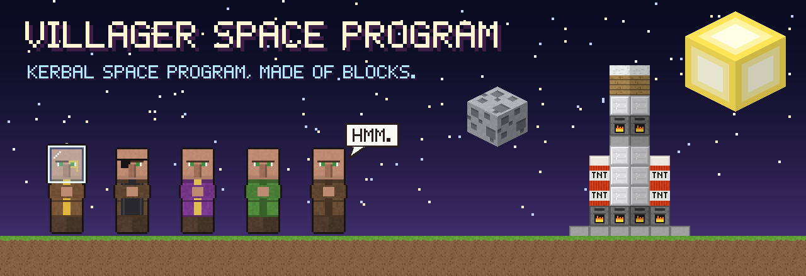

<br>

### Kerbal Space Program, but every Kerbal is a villager and every part is a block.

<sub>Real KSP physics. Real orbits. Very square everything else.</sub>

<br><br>


<br>

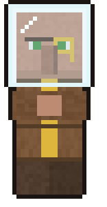&nbsp;&nbsp;
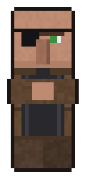&nbsp;&nbsp;
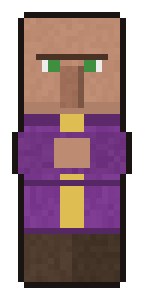&nbsp;&nbsp;
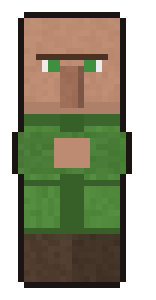&nbsp;&nbsp;
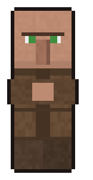

</div>

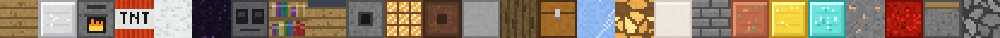

## 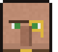 Meet the crew

Every Kerbal is now a villager: big nose, one long eyebrow, arms crossed, and a glass block
over their head when they step outside. They walk, climb ladders, sit in seats and flop
around with the normal Kerbal animations. You'll find them everywhere Kerbals used to be: the
crew portraits, inside the pod, out on EVA, and in the little crowds wandering the Space Center.

<div align="center">

|  |  |  |  |  |
| :---: | :---: | :---: | :---: | :---: |
| **Pilots**<br><sub>gold monocle</sub> | **Engineers**<br><sub>work apron + eye patch</sub> | **Scientists**<br><sub>purple robe</sub> | **Tourists**<br><sub>green robe</sub> | **Everyone else**<br><sub>classic brown robe</sub> |

</div>

And nobody is called Kerman any more. Villagers only ever say one thing, so that's their
surname now:

<div align="center">

### Jebediah Kerman &nbsp;→&nbsp; Jebediah **Hmm**

<sub>Bill Hmm. Bob Hmm. Valentina Hmm. First names never change.</sub>

<br><br>

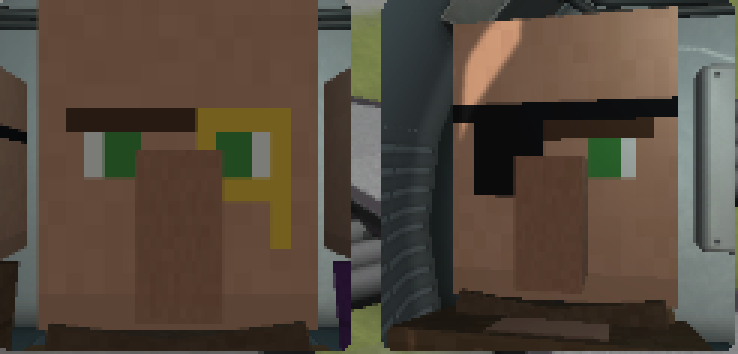&nbsp;
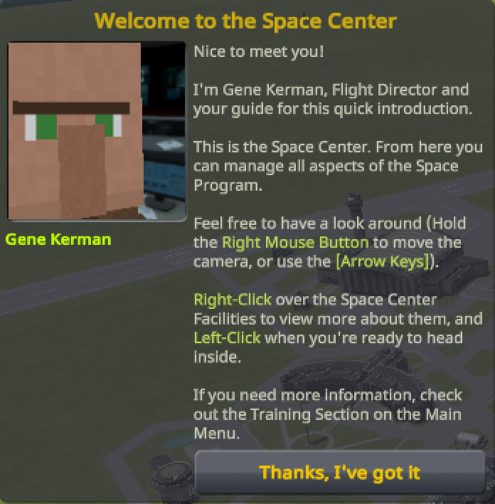

<sub>Jeb and Bill reporting for duty. Even Gene, the flight director, got the memo.</sub>

</div>


## 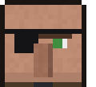 Every part is a block

All 465 parts, including both expansions, turn into blocks. Each one is picked by what the
part *does*. Tall parts stack up into columns of blocks, and the icons in the editor match.
Colliders, drag, mass and engine effects aren't touched, so your rockets fly exactly the same.

<div align="center">

| | | | |
| :---: | :--- | :---: | :--- |
| 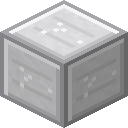 | **Fuel tanks**<br><sub>Block of iron</sub> | 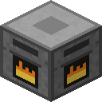 | **Liquid engines**<br><sub>Lit furnace</sub> |
| 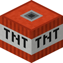 | **Solid boosters**<br><sub>TNT, obviously</sub> | 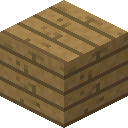 | **Crewed pods**<br><sub>Oak planks</sub> |
| 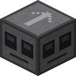 | **Probe cores**<br><sub>Observer</sub> | 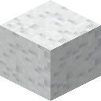 | **Parachutes**<br><sub>White wool</sub> |
| 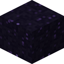 | **Heat shields**<br><sub>Obsidian</sub> | 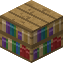 | **Science parts**<br><sub>Bookshelf</sub> |
| 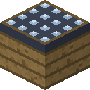 | **Solar panels**<br><sub>Daylight detector</sub> | 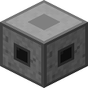 | **RCS thrusters**<br><sub>Dispenser</sub> |
| 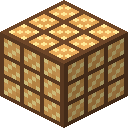 | **Reaction wheels**<br><sub>Redstone lamp</sub> | 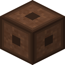 | **Antennas**<br><sub>Note block</sub> |
| 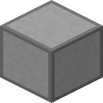 | **Decouplers & docking ports**<br><sub>Smooth stone</sub> | 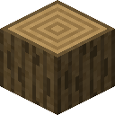 | **Landing legs & wheels**<br><sub>Oak log</sub> |
| 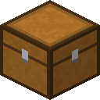 | **Cargo bays**<br><sub>Chest</sub> | 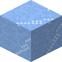 | **Radiators**<br><sub>Packed ice</sub> |
| 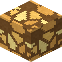 | **Lights**<br><sub>Glowstone</sub> | 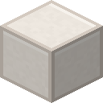 | **Nose cones, fins & wings**<br><sub>Block of quartz</sub> |
| 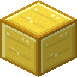 | **Monopropellant tanks**<br><sub>Block of gold</sub> |  | **Xenon tanks**<br><sub>Block of diamond</sub> |
| 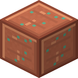 | **Jet fuel tanks**<br><sub>Block of copper</sub> | 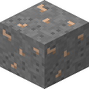 | **Ore tanks**<br><sub>Iron ore</sub> |
| 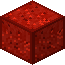 | **Batteries**<br><sub>Block of redstone</sub> | 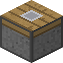 | **Robotics**<br><sub>Piston</sub> |
| 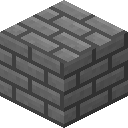 | **Structural parts**<br><sub>Stone bricks</sub> | 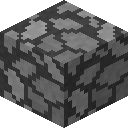 | **Everything else**<br><sub>Cobblestone</sub> |

<br>

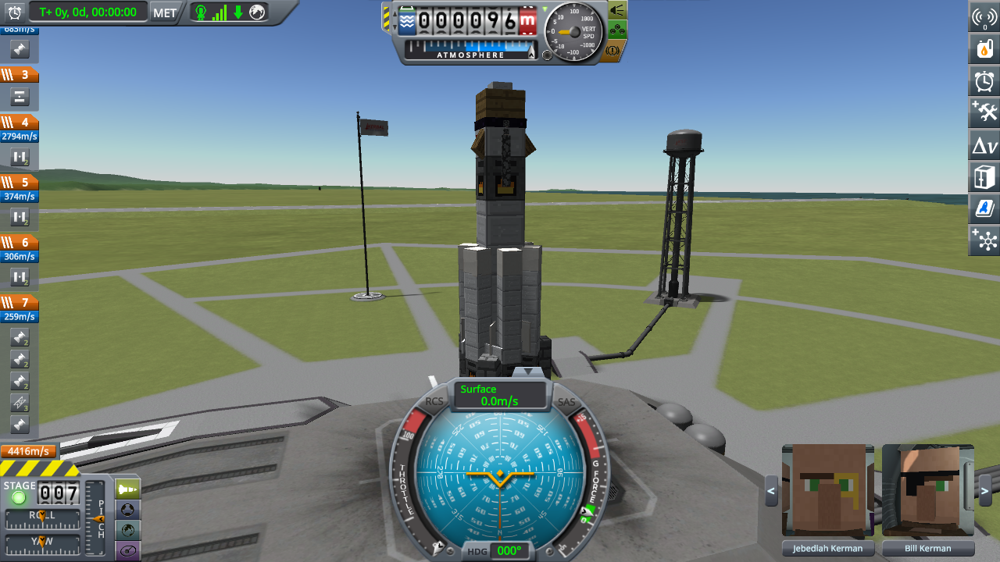&nbsp;
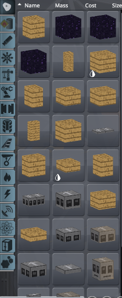

<sub>The stock Kerbal X on the pad: oak pod, iron tanks, furnace engines. The editor's parts list matches.</sub>

</div>


## 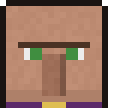 The sky is made of blocks too

<div align="center">

| 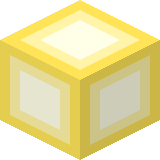 | 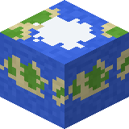 | 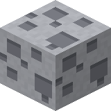 |
| :---: | :---: | :---: |
| **The Sun**<br><sub>a glowing block, no glare</sub> | **Kerbin**<br><sub>oceans, grass, sand and snow</sub> | **The Mun**<br><sub>four shades of stone</sub> |

</div>

From space, the Sun, Kerbin and the Mun are giant pixel-art blocks. Kerbin and the Mun are
painted from their own maps, so the continents, oceans and craters are where they should be,
just very chunky. They spin with the planets and the Sun lights them. Fly close enough to
land and the real round world comes back, so terrain, landings and orbits all work as normal.

<div align="center">

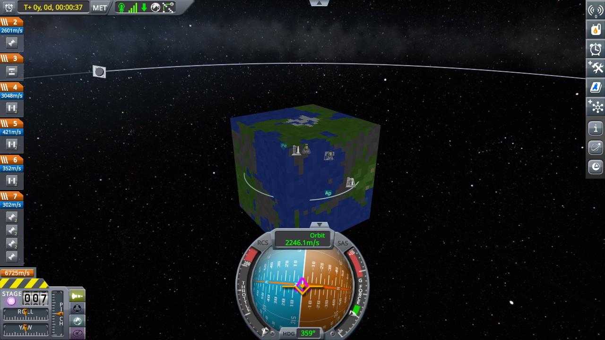

<sub>Kerbin from the map view, with your orbit wrapped around it.</sub>

</div>


## 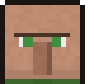 Screenshots

<div align="center">

| 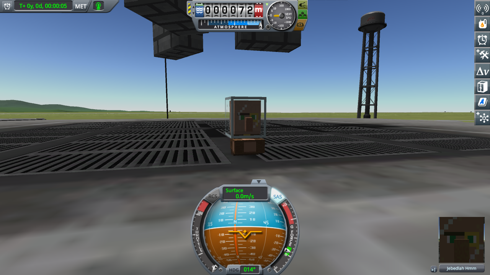 | 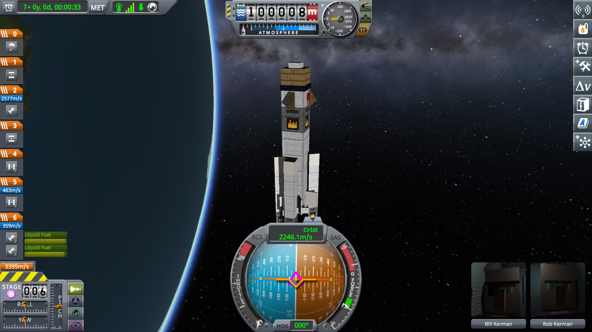 |
| :---: | :---: |
| <sub>Jebediah Hmm stretching his legs on the launch pad</sub> | <sub>A 100 km orbit, Kerbin below, the Milky Way behind</sub> |

</div>


## 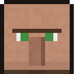 Install

You need **Kerbal Space Program 1.12** on Windows. That's it: the build script uses the C#
compiler that comes with Windows and builds against your own copy of KSP, so there's nothing
else to download.

```powershell
git clone https://github.com/radhepa/Villager-Space-Program.git
cd Villager-Space-Program
.\build.ps1 -Install -Ksp "C:\path\to\Kerbal Space Program"
```

This puts the mod in `GameData\VillagerSpaceProgram`. To uninstall, delete that folder.

### Settings

`GameData/VillagerSpaceProgram/PluginData/settings.cfg`

| Setting | Default | What it does |
| --- | --- | --- |
| `rename_surnames` | `true` | Renames every Kerman to Hmm. KSP keeps names inside your save, so this is a real rename. Set it to `false` and load the save again to turn everyone back into Kermans. |

<details>
<summary><b>How it works</b></summary>
<br>

| File | What it does |
| --- | --- |
| `src/BlockParts.cs` | At the main menu, gives every part (and its editor icon) a tiled block mesh sized to the original model, and hides the original meshes. |
| `src/Villagers.cs` | Finds every Kerbal, hides it, and builds a box villager sized from its skeleton. Each box follows a bone every frame, so the villager moves with the Kerbal animations. |
| `src/Surnames.cs` | Renames Kerman to Hmm, or back again. |
| `src/BlockSky.cs`, `src/CubeWorld.cs` | Paint and draw the Sun, Kerbin and Mun blocks, and switch off the sun glare. |
| `src/Core.cs` | Texture loading, materials and the box mesh builder. |
| `src/DevTour.cs` | A self-test that only runs when `PluginData/devtour.txt` exists: it plays a throwaway sandbox game and saves screenshots. |
| `tools/make_textures.py` | Draws every in-game texture as original pixel art. |
| `tools/make_readme_art.py` | Draws the art on this page from those textures. |

</details>

<details>
<summary><b>About the art</b></summary>
<br>

Every block, villager and sky texture is drawn from scratch by `tools/make_textures.py`, as
lookalikes built from noise, frames and simple shapes. No Minecraft or KSP files are included in
this repository.

</details>

<br>

<div align="center">


**Hmm.**

<sub>A fan-made mod for personal use. Not affiliated with Squad, Private Division, Mojang or
Microsoft. Kerbal Space Program and Minecraft belong to their owners.</sub>

</div>
